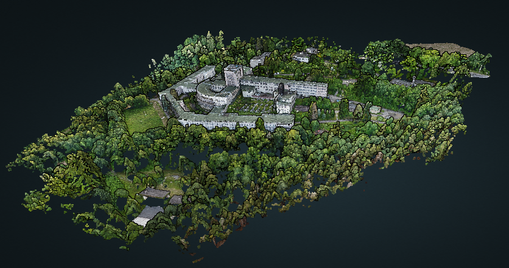

# Description

This dataset was captured with DJI Mavic Mini, and Litchi app. Flight plan was made with RStats library flightplanning-R by Caio Hamamura (https://github.com/caiohamamura/flightplanning-R).

Objects presented are Regional Centre for Paediatric care in Istebna. This hospital was build in 1930-1938 at Kubalonka pass in Beskidy mountains. That was one of the biggest healtcare buildings in II Republic of Poland, with great modernist architecture.

More info about WCP Kubalonka: https://pl.wikipedia.org/wiki/Wojew%C3%B3dzkie_Centrum_Pediatrii_Kubalonka_w_Istebnej

# Imagery

Images are geotagged JPEGs with dimensions 4000x3000, with 10 degrees off-nadir (for better 3D, with non grid filght plan)
